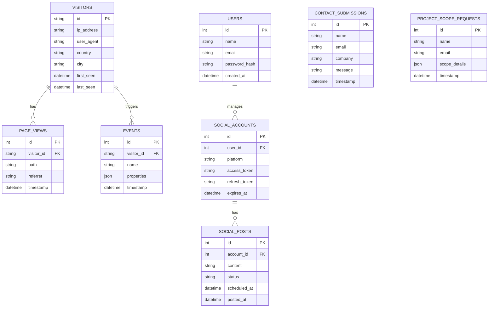

# PILON Qubit Ventures - Backend Dashboard Architecture

This document outlines the proposed architecture and database schema for the new backend dashboard. The goal is to create a comprehensive system for visitor tracking, request management, social media automation, and ROI optimization, leveraging the latest AI technologies.

## 1. System Architecture

The dashboard will be built as a full-stack application integrated into the existing Next.js project. It will follow a modern, scalable, and secure architecture pattern.

### Technology Stack

| Layer             | Technology                                      | Justification                                                                 |
| ----------------- | ----------------------------------------------- | ----------------------------------------------------------------------------- |
| **Frontend**        | Next.js (React), Tailwind CSS                   | Consistent with the existing website for seamless integration and UI.         |
| **Backend**         | Next.js API Routes                              | Serverless functions for scalability and ease of development.                 |
| **Database**        | PostgreSQL                                      | Robust, relational, and scalable for structured data.                         |
| **Authentication**  | NextAuth.js                                     | Secure, easy-to-implement authentication with multiple providers.             |
| **Analytics**       | PostHog (self-hosted or cloud)                  | Comprehensive product analytics, session recording, and feature flags.        |
| **Social Media**    | Buffer API, OpenAI API, Stability AI API        | Best-in-class APIs for scheduling, content generation, and image creation.    |
| **Automation**      | n8n.io (self-hosted) or Zapier                  | Powerful workflow automation to connect services and schedule tasks.          |

### Architecture Diagram

```mermaid
graph TD
    subgraph "User Interface"
        A[PILON Qubit Website] --> B{Next.js API Routes};
        C[Backend Dashboard] --> B;
    end

    subgraph "Backend Services"
        B --> D[PostgreSQL Database];
        B --> E[NextAuth.js];
        B --> F[PostHog Analytics];
        B --> G[Social Media APIs];
        B --> H[AI Content Generation APIs];
    end

    subgraph "Third-Party Services"
        G --|> I[Buffer API];
        G --|> J[LinkedIn API];
        G --|> K[X/Twitter API];
        H --|> L[OpenAI GPT-4];
        H --|> M[Stability AI];
    end

    D -- "Stores all application data" --> B;
    E -- "Handles user authentication" --> C;
    F -- "Tracks visitor behavior" --> A;
    F -- "Provides analytics data" --> C;
```

## 2. Database Schema

The PostgreSQL database will store all critical data for the dashboard. The schema is designed to be relational and scalable.

### Schema Diagram



## 3. Implementation Plan

The development will be broken down into the following phases:

1.  **Phase 1: Visitor Tracking & Analytics**
    - Set up PostgreSQL database.
    - Implement NextAuth.js for dashboard authentication.
    - Integrate PostHog for visitor tracking and session recording.
    - Build initial dashboard UI to display analytics.

2.  **Phase 2: Social Media Management**
    - Implement OAuth2 for connecting social media accounts (Buffer, LinkedIn, X/Twitter).
    - Create UI for composing and scheduling posts.
    - Integrate with OpenAI API for text generation and Buffer API for scheduling.

3.  **Phase 3: AI-Powered Content Creation**
    - Build an interface for generating social media content ideas.
    - Integrate with Stability AI for image generation.
    - Create templates for different types of content (e.g., announcements, blog post promotions).

4.  **Phase 4: ROI & Request Management**
    - Track submissions from contact and project scope forms.
    - Build a simple CRM to manage leads and requests.
    - Implement conversion tracking to measure social media ROI.

5.  **Phase 5: Deployment & Documentation**
    - Deploy the dashboard to Vercel.
    - Create comprehensive documentation for using the dashboard.
    - Provide a live demo and handoff.

This architecture provides a solid foundation for a powerful and scalable backend system. I will proceed with Phase 1 of the implementation plan, starting with the database and authentication setup.
